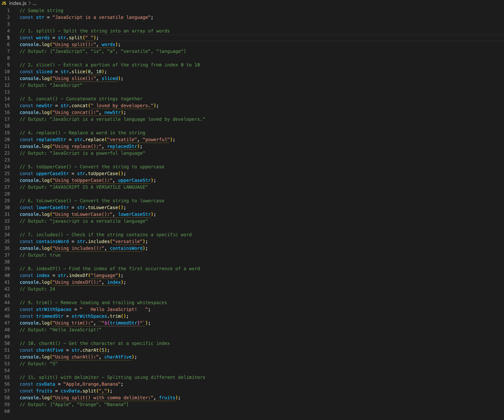

# Mastering JavaScript String Manipulation

##

## Description 📄
In this assignment, you will explore and practice using several common JavaScript string methods such as `split()`, `slice()`, `concat()`, `replace()`, and more. These methods allow you to manipulate strings by splitting them into arrays, extracting portions, replacing content, and transforming the case of characters. You will write a single JavaScript file (`index.js`) to log these operations to the console and verify the output.

## Expected Project Structure 🏗️
Your project should be structured as follows:

```plaintext
js-string-methods/ index.js
```

## Instructions ✅

### 1. **Create the Project Folder and File**
Set up your project structure.

- [ ] Create a folder named `js-string-methods` to store all your project files.

- [ ] Inside the `js-string-methods` folder, create a file named `index.js`. This will be your main JavaScript file where all the code will be written.

## 2. **Declare and Assign the Initial String Variable**
In this step, you'll declare a string variable named `str`, which will be used in all the following examples for performing various string manipulations.

- [ ] Open your `index.js` file and add the following code to declare and initialize the variable `str`:

```javascript

// Declare a string variable that will be used for all examples
const str = "JavaScript is a versatile language";
console.log("Initial String:", str);

```
- [ ]  Using node, run the index.js file in a terminal and verify the output.

**Expected Output:**
```
Initial String: JavaScript is a versatile language

```

**Explanation:**
- The string variable str is initialized with the value "JavaScript is a versatile language". 
- This string will serve as the base for all the string manipulations in the upcoming steps. 
- In each subsequent example, the methods will reference and modify str to demonstrate various string operations.

##

### 3. **Split the String into an Array of Words**
Start by splitting the string `"JavaScript is a versatile language"` into an array of words using the `split()` method.

- [ ] Add the following code to your `index.js` file:

```javascript

// Split the string into an array of words
const words = str.split(" ");
console.log("Using split():", words);

```

 - [ ] Using node, run the `index.js` file in a terminal and verify the output.

**Expected Output:**
```
Using split(): ["JavaScript", "is", "a", "versatile", "language"]

```

**Explanation:**
- The split() method takes the initial string str (which is "JavaScript is a versatile language")
- Splits it into a new array, using the spaces (" ") as the delimiter. 
- Each word in str is placed into an array named `words`. 
- This is useful when you need to break a sentence or paragraph into individual words.

##

### 4. **Split the String into an Array of Words**
Next, extract a portion of the string using the slice() method, which allows you to select a specific part of the string.

- [ ] Add the following code to your `index.js` file:

```javascript

// Extract a portion of the string from index 0 to 10
const sliced = str.slice(0, 10);
console.log("Using slice():", sliced);

```

 - [ ] Using node, run the `index.js` file in a terminal and verify the output.

**Expected Output:**
```
Using slice(): JavaScript

```

**Explanation:**
- The slice() method is applied to the initial string str (which is "JavaScript is a versatile language")
- Extracts the portion of the string from index 0 to 10. This returns the first word, "JavaScript", from the original string. 
- The slice() method does not modify str; it returns a new string called `sliced` based on the specified indices.

##

### 5. Concatenate Strings Using `concat()`
You can combine multiple strings together using the `concat()` method.

- [ ] Add the following code to your `index.js` file:

```javascript

const newStr = str.concat(" loved by developers.");
console.log("Using concat():", newStr);

```

 - [ ] Using node, run the `index.js` file in a terminal and verify the output.

**Expected Output:**
```
Using concat(): JavaScript is a versatile language loved by developers.

```

**Explanation:**
- The `concat()` method takes the original string str (which is "JavaScript is a versatile language")
- Appends it to another string (" loved by developers."). 
- This does not change the original str, but instead returns a new string called `newStr` with the concatenated result. 
- This is useful for combining multiple strings into one.

##


### 6. **Replace a Word Using `replace()`**
Use the `replace()` method to replace a specific word in the string.

- [ ] Add the following code to your `index.js` file:

```javascript
// Replace a word in the string
const replacedStr = str.replace("versatile", "powerful");
console.log("Using replace():", replacedStr);
```

- [ ] Using `node`, run the `index.js` file in the terminal and verify the output.

**Expected Output:**
```
Using replace(): JavaScript is a powerful language
```

**Explanation:**
- The `replace()` method finds the word `"versatile"` in `str` (which is `"JavaScript is a versatile language"`)
- It replaces it with `"powerful"`. 
- The original string `str` remains unchanged, but a new string `replaceStr` is returned with the modification. 
- This method is useful for making targeted changes to a string.

##

### 7. **Convert to Uppercase Using `toUpperCase()`**
Convert the string to uppercase using the `toUpperCase()` method.

- [ ] Add the following code to your `index.js` file:

```javascript
// Convert the string to uppercase
const upperCaseStr = str.toUpperCase();
console.log("Using toUpperCase():", upperCaseStr);
```

- [ ] Using `node`, run the `index.js` file in the terminal and verify the output.

**Expected Output:**
```
Using toUpperCase(): JAVASCRIPT IS A VERSATILE LANGUAGE
```

**Explanation:**
- The `toUpperCase()` method takes the original string `str` (which is `"JavaScript is a versatile language"`)
- It converts all the characters to uppercase.
- The original string `str` remains unchanged, but a new string `upperCaseStr` is returned.
- This method is useful for converting strings to all uppercase letters.

---

### 8. **Convert to Lowercase Using `toLowerCase()`**
Convert the string to lowercase using the `toLowerCase()` method.

- [ ] Add the following code to your `index.js` file:

```javascript
// Convert the string to lowercase
const lowerCaseStr = str.toLowerCase();
console.log("Using toLowerCase():", lowerCaseStr);
```

- [ ] Using `node`, run the `index.js` file in the terminal and verify the output.

**Expected Output:**
```
Using toLowerCase(): javascript is a versatile language
```

**Explanation:**
- The `toLowerCase()` method takes the original string `str` (which is `"JavaScript is a versatile language"`)
- It converts all the characters to lowercase.
- The original string `str` remains unchanged, but a new string `lowerCaseStr` is returned.
- This method is useful for converting strings to all lowercase letters.

---

### 9. **Check if the String Contains a Word Using `includes()`**
Check if the string contains the word `"versatile"` using the `includes()` method.

- [ ] Add the following code to your `index.js` file:

```javascript
// Check if the string contains the word "versatile"
const containsWord = str.includes("versatile");
console.log("Using includes():", containsWord);
```

- [ ] Using `node`, run the `index.js` file in the terminal and verify the output.

**Expected Output:**
```
Using includes(): true
```

**Explanation:**
- The `includes()` method checks if the word `"versatile"` is present in the string `str` (which is `"JavaScript is a versatile language"`)
- It returns `true` if found, otherwise `false`.
- The original string `str` remains unchanged.

---

### 10. **Find the Index of a Word Using `indexOf()`**
Find the index where the word `"language"` starts in the string using the `indexOf()` method.

- [ ] Add the following code to your `index.js` file:

```javascript
// Find the index of the word "language"
const index = str.indexOf("language");
console.log("Using indexOf():", index);
```

- [ ] Using `node`, run the `index.js` file in the terminal and verify the output.

**Expected Output:**
```
Using indexOf(): 24
```

**Explanation:**
- The `indexOf()` method returns the starting index of the word `"language"` in the string `str` (which is `"JavaScript is a versatile language"`)
- The original string `str` remains unchanged.
- A new variable `index` holds the index position.

---

### 11. **Remove Leading and Trailing Whitespace Using `trim()`**
Remove the leading and trailing whitespace from the string using the `trim()` method.

- [ ] Add the following code to your `index.js` file:

```javascript
// Remove leading and trailing whitespace
const strWithSpaces = "   Hello JavaScript!   ";
const trimmedStr = strWithSpaces.trim();
console.log("Using trim():", `"${trimmedStr}"`);
```

- [ ] Using `node`, run the `index.js` file in the terminal and verify the output.

**Expected Output:**
```
Using trim(): "Hello JavaScript!"
```

**Explanation:**
- The `trim()` method removes the whitespace from both the start and end of the string `strWithSpaces` (which is `"   Hello JavaScript!   "`)
- The original string `strWithSpaces` remains unchanged.
- A new string `trimmedStr` is returned without the leading and trailing whitespace.

---

### 12. **Get a Character at a Specific Index Using `charAt()`**
Retrieve the character at index `5` in the string using the `charAt()` method.

- [ ] Add the following code to your `index.js` file:

```javascript
// Get the character at index 5
const charAtFive = str.charAt(5);
console.log("Using charAt():", charAtFive);
```

- [ ] Using `node`, run the `index.js` file in the terminal and verify the output.

**Expected Output:**
```
Using charAt(): S
```

**Explanation:**
- The `charAt()` method retrieves the character at index `5` from the string `str` (which is `"JavaScript is a versatile language"`)
- A new variable `charAtFive` holds the character found at that position.

---

### 13. **Split a CSV String Using a Comma Delimiter**
Finally, split a CSV (Comma-Separated Values) string into an array using the `split()` method with a comma delimiter.

- [ ] Add the following code to your `index.js` file:

```javascript
// Split a CSV string into an array
const csvData = "Apple,Orange,Banana";
const fruits = csvData.split(",");
console.log("Using split() with comma delimiter:", fruits);
```

- [ ] Using `node`, run the `index.js` file in the terminal and verify the output.

**Expected Output:**
```
Using split() with comma delimiter: ["Apple", "Orange", "Banana"]
```

**Explanation:**
- The `split()` method splits the CSV string `csvData` (which is `"Apple,Orange,Banana"`) by commas into an array.
- The original string `csvData` remains unchanged, while a new array `fruits` holds the split elements.

---

### 14. **Commit and Push to Github**

After completing all the tasks, it's time to commit and push your work to GitHub.

- [ ] Commit your changes with a descriptive message like `"Add string manipulation examples"`.

- [ ] Push your code to a GitHub repository.

---

## Conclusion 📄

In this assignment, you practiced working with several common JavaScript string methods such as `split()`, `slice()`, `concat()`, `replace()`, and more. These methods are essential for string manipulation and allow you to transform and work with string data in various ways. By going through each example, you have gained a strong understanding of how to use these methods effectively in JavaScript.

##

### Solution codebase 👀
🛑 **Only use this as a reference** 🛑

💾 **Not something to copy and paste** 💾

**Note:**  This lab references a solution file located [here](https://github.com/HackerUSA-CE/aisd-jse-string-methods/tree/solution) (link not shown).


---
© All rights reserved to ThriveDX